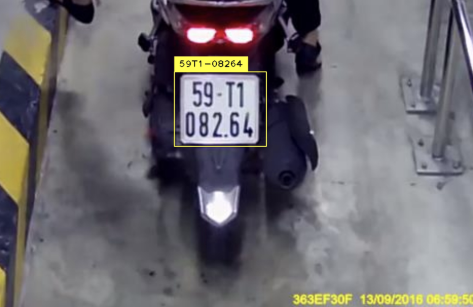
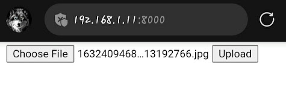
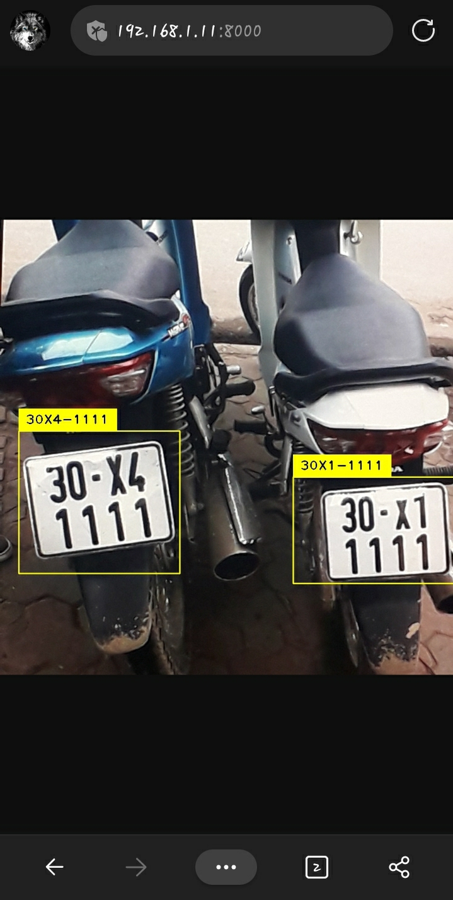

# License-plate-recognition-YOLO

## Hướng dẫn chạy

Cài các package cần thiết bằng lệnh:
> pip install -r requirements.txt

Chạy thử:
> python example.py -i [PathToImage]

Kết quả lưu trong `result.jpg`

## Hướng dẫn chạy server trên máy tính dùng cho mạng LAN

Chạy server:
> python run_server.py

Vô trang: http://localhost:8000/

Chọn tệp và bấm upload, chờ một chút có kết quả trả về.

Mở trên điện thoại cùng LAN vẫn được 😀

